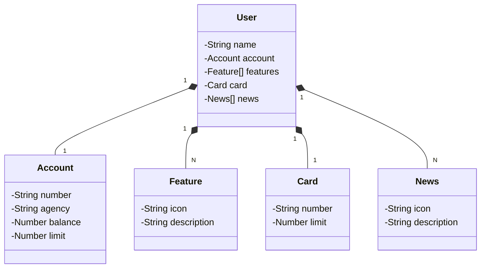

# DIO Project Rest API

This repository contains the implementation of a REST API developed as part of the Decola Tech 2025 Challenge Projects by DIO.

## Project Overview

The goal of this project is to build a robust and scalable REST API using modern development practices. The API provides endpoints for managing resources and demonstrates key concepts such as:

- RESTful principles
- CRUD operations
- Data validation
- Error handling
- API documentation
  
## Technologies Used

<div align="center">

| Category              | Technology                                                                                     |
|-----------------------|-----------------------------------------------------------------------------------------------|
| **Programming Language** |  |
| **Framework**         |  |
| **ORM Framework**      |  |
| **Database**          |  <br>  |
| **Tools**             |  <br>  <br>  |

</div>

## Features

- **User Management**: Create, read, update, and delete user accounts with secure authentication and authorization.
- **Resource Management**: Manage resources with full CRUD functionality and validation.
- **Error Handling**: Comprehensive error responses for invalid requests and server issues.
- **Database Integration**: Persistent data storage using PostgreSQL and in-memory testing with H2.
- **API Documentation**: Auto-generated API documentation using Swagger/OpenAPI.

## Getting Started

### Prerequisites

- **Java JDK 11 or higher**: Ensure you have Java Development Kit installed. You can download it from [Oracle](https://www.oracle.com/java/technologies/javase-downloads.html) or [OpenJDK](https://openjdk.org/).
- **Maven**: Install Apache Maven for building and managing the project. Download it from [Maven's official site](https://maven.apache.org/).
- **Git**: Ensure Git is installed for cloning the repository. Download it from [Git's official site](https://git-scm.com/).
- **Railway**: Set up a Railway account for deploying the application. Visit [Railway's official site](https://railway.app/) to get started.
- **Postman**: Install Postman for testing API endpoints. Download it from [Postman's official site](https://www.postman.com/).
- **Insomnia**: Alternatively, you can use Insomnia for API testing. Download it from [Insomnia's official site](https://insomnia.rest/).

### Check Installation Steps

1. **Java JDK**:
    - Verify installation:
      ```bash
      java -version
      ```
    - Ensure the version is 11 or higher.

2. **Maven**:
    - Verify installation:
      ```bash
      mvn -v
      ```
    - Ensure Maven is properly configured in your system's PATH.

3. **Git**:
    - Verify installation:
      ```bash
      git --version
      ```
    - Ensure Git is installed and accessible from the command line.

4. **Railway**:
    - Sign up or log in to Railway.
    - Familiarize yourself with deploying applications using Railway's documentation.

6. **Postman**:
    - Install and set up Postman for testing API endpoints.
    - Create a new collection to organize your API requests.

7. **Insomnia**:
    - Install and configure Insomnia as an alternative to Postman.
    - Import or create requests for testing the API.

### Getting the Repository

1. Clone the repository:
    ```bash
    git clone https://github.com/Zh0ny/DIOProjectRestAPI.git
    ```
2. Navigate to the project directory:
    ```bash
    cd DIOProjectRestAPI
    ```

### Running the Application

1. Start the server using Maven:
    ```bash
    ./mvnw spring-boot:run
    ```
2. Alternatively, start the server using Visual Studio Code:
    - Open the project in VS Code.
    - Ensure the "Spring Boot Extension Pack" is installed.
    - Navigate to the "Run and Debug" tab or press `Ctrl+Shift+D`.
3. Access the API via Swagger at:
   ```
   http://localhost:8080/swagger-ui.html
   ```

## API Endpoints

<div align="center">

| Method | Endpoint           | Description                       |
|--------|--------------------|-----------------------------------|
| GET    | `/users/{id}`      | Fetch a user account by ID        |
| POST   | `/users`           | Create a new user account         |

</div>

## Class Diagram (API Domain)



## Contributing

Contributions are welcome! Please follow these steps:

1. Fork the repository.
2. Create a new branch:
    ```bash
    git checkout -b feature/your-feature-name
    ```
3. Commit your changes:
    ```bash
    git commit -m "Add your message here"
    ```
4. Push to the branch:
    ```bash
    git push origin feature/your-feature-name
    ```
5. Open a pull request.

## License

This project is licensed under the [MIT License](LICENSE).

